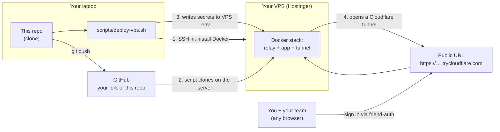
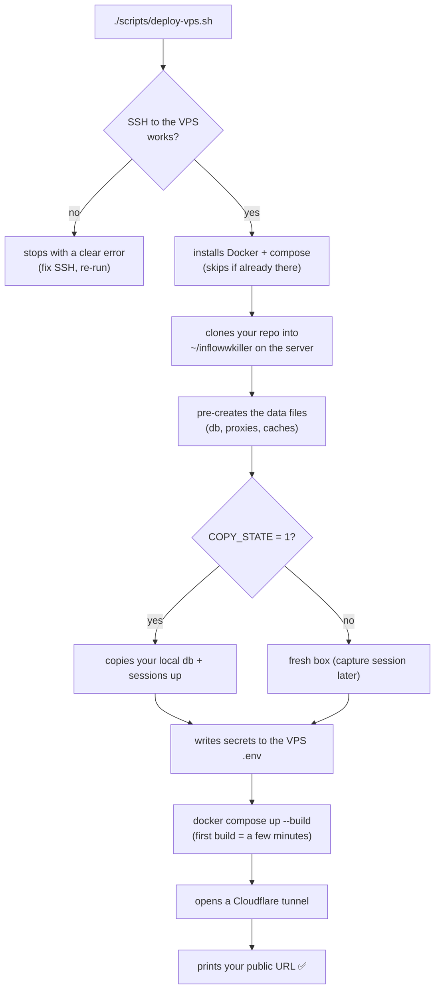
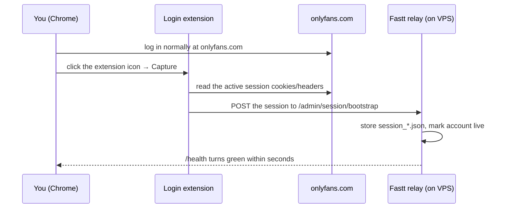
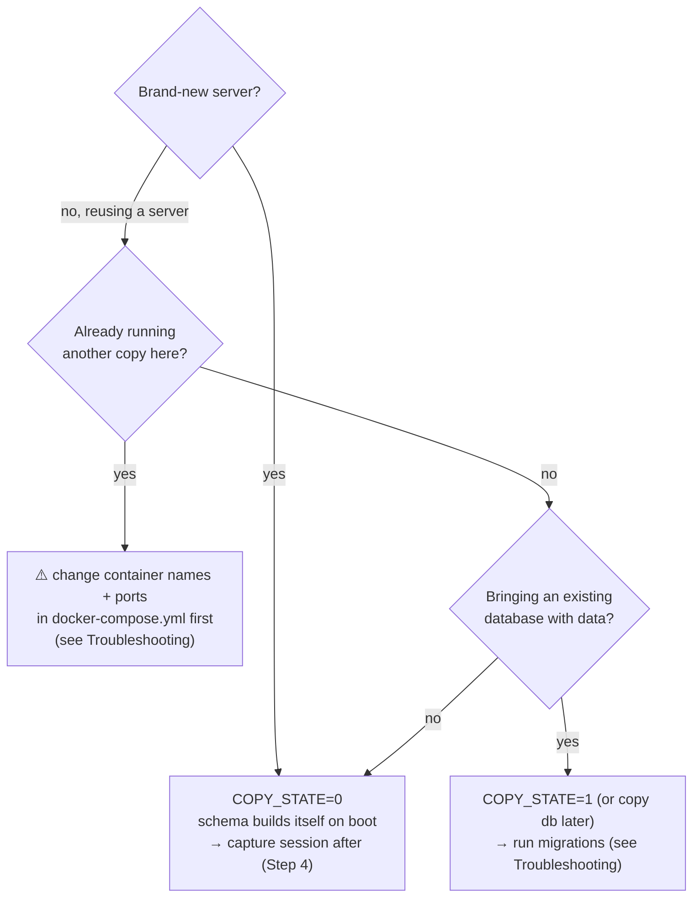

# Deploy Fastt to your own VPS

> **How to use this file.** You don't need to understand any of it. Open
> [Claude Code](https://claude.com/claude-code) in a terminal inside this repo
> and paste this whole file in with a message like *"walk me through deploying
> this to my Hostinger VPS — I'll give you the details as you ask."* Claude has
> everything it needs below to do the deploy with you, step by step. The rest of
> this document is written so a human can follow it alone too.

One command does the whole deploy: it installs Docker on your server, pulls the
code, writes your secrets, brings the stack up, and hands you back a URL.
You edit one block of settings, run one script, then sign in.

> **Exposure options (read first).** By default the one-paste deploy now serves
> the dashboard as plain http on your server's IP (`http://<ip>:3000`) — simplest,
> no domain. For a real **https** URL prefix the command with
> `DOMAIN=you.duckdns.org` (free DuckDNS — needs the Hostinger **n8n plan**'s
> Traefik) or `TUNNEL=1` (throwaway URL, no Traefik). The `trycloudflare` steps
> shown below are the `TUNNEL=1` path. All options at a glance:
> **[deploy/README.md](deploy/README.md)**.

---

## The big picture



Your laptop only runs the script. The **server** pulls the code straight from the
public GitHub repo — so for a normal deploy you don't fork or push anything. (You
only need your own fork if you want to ship *modified* code; see Step 1.)

---

## What you need before you start

| You need | Where to get it | Required? |
|---|---|---|
| **A VPS** (Hostinger, Hetzner, DigitalOcean…) | Any Ubuntu/Debian box. Note its IP. | Yes |
| **SSH access to it with your key** | `ssh root@<ip>` must work **without a password**. Hostinger lets you paste your public key when you create the box. | Yes |
| **A GitHub fork of this repo** | Only if you want to deploy *modified* code — the script clones the public upstream by default. | No |
| **A DeepSeek API key** | <https://platform.deepseek.com> — this is the AI that writes messages. | Yes (for any AI send) |
| **Docker on your laptop** | Not needed locally — the script installs it **on the server**. | No |
| **An OnlyFans login** | Captured *after* deploy via the Chrome extension (see below). | At use time |

> **Don't have an SSH key yet?** Run `ssh-keygen -t ed25519` once, then add the
> printed `~/.ssh/id_ed25519.pub` to the VPS (Hostinger: paste it in the panel;
> or `ssh-copy-id root@<ip>` if password login is on). Test with `ssh root@<ip>`.

---

## The deploy, step by step

### Step 1 — (optional) fork, only if you're changing the code

For a stock deploy, **skip this** — the script clones the public repo for you.
Fork only if you want to deploy your own modifications:

```bash
# inside this repo folder, after making changes
gh repo create <you>/inflowwkiller --private --source=. --push
# then set REMOTE_REPO_URL to your fork in Step 2
```

### Step 2 — fill in the one settings block

Open [scripts/deploy-vps.sh](scripts/deploy-vps.sh) and edit **only** the block
marked `EDIT BEFORE RUNNING`. For a stock deploy that's `SSH_TARGET` + your
secrets; everything else is pre-filled:

| Setting | Set it to | Notes |
|---|---|---|
| `SSH_TARGET` | `root@<your-vps-ip>` | **The one line you must change.** The script refuses to run while it says `YOUR_VPS_IP`. |
| `SSH_PORT` | `22` | Change only if your VPS uses a non-standard SSH port. |
| `REMOTE_REPO_URL` | pre-filled (public upstream) | Leave as-is. Repoint at your fork only for modified code; SSH URL + deploy key if the fork is **private**. |
| `BRANCH` | `main` | Default upstream branch. |
| `SESSION_SECRET` | output of `openssl rand -hex 32` | Cookie signing key. **Set once.** Leave empty on later redeploys to keep it. |
| `CHATTER_SESSION_SECRET` | another `openssl rand -hex 32` | Same idea, for the chatter login. |
| `DEEPSEEK_API_KEY` | your key | Needed before any AI message can send. |
| `GROK_API_KEY` | your key, or leave empty | Optional / legacy. |
| `SHARE_TOKEN` | empty, **or** `openssl rand -hex 24` | Empty = the friend-auth login is the only gate. A value = the URL also needs `?t=<token>`. |
| `COPY_STATE` | `0` | `0` = fresh server, capture the OF session after boot (recommended). `1` = also copy a local database/sessions up. |

These secrets are written to `.env` **on the server** (locked to `chmod 600`) —
they are never committed to GitHub.

### Step 3 — run it

```bash
./scripts/deploy-vps.sh
```

That's the whole deploy. Here's what it does on its own:



On success it prints something like:

```
✓ Fastt is live.
  URL:  https://shiny-forest-1234.trycloudflare.com
  Host: root@<your-vps-ip>
```

Open that URL and sign in. **The trycloudflare subdomain changes every time the
stack restarts** — the script prints the command to fetch the current one.

### Step 4 — connect an OnlyFans account

The server boots with **no** OnlyFans login. You add one by capturing your live
browser session with the bundled Chrome extension — no password is ever typed
into Fastt:



Load `loginExtension/` (or `noTeleportLoginExtension/` if you use a proxy) at
`chrome://extensions` → **Load unpacked**, log in to OnlyFans in the same
browser, click the icon, and point it at your Fastt URL. Done — the dashboard
now has your account.

---

## Fresh box vs. reuse — which path am I on?



A fresh VPS is by far the simplest path — choose it unless you have a reason not
to.

---

## Verify it worked

```bash
# all containers up + healthy?
ssh root@<ip> 'cd ~/inflowwkiller && docker compose ps'

# the public site responds?
curl -sS -o /dev/null -w "%{http_code}\n" https://<your-url>/login   # expect 200
```

In the browser: the login page loads, you can sign in, and after Step 4 the
account shows up in the inbox.

---

## Redeploy / roll back later

```bash
# pull the latest upstream code + rebuild (idempotent — keeps your secrets + data)
./scripts/deploy-vps.sh
# (deploying your own fork? push it first, then run the script)

# roll back to an earlier version
ssh root@<ip> 'cd ~/inflowwkiller && git checkout <commit> && docker compose up -d --build'

# take the public URL offline without stopping everything
ssh root@<ip> 'cd ~/inflowwkiller && docker compose --profile tunnel stop tunnel'
```

---

## Troubleshooting

**"cannot SSH to the host"** — your key isn't on the VPS, or the IP/port is
wrong. `ssh root@<ip>` must work with no password before the script will.

**The relay won't start / crash-loops** — usually a missing API key. Check
`ssh root@<ip> 'cd ~/inflowwkiller && docker compose logs --tail=50 relay'`. Make
sure `DEEPSEEK_API_KEY` is set in the VPS `.env`.

**The trycloudflare URL changed and the old one 404s** — that's expected; the
free tunnel rotates on restart. Fetch the live one:
`ssh root@<ip> 'docker logs chatterly-tunnel | grep trycloudflare | tail -1'`.

**Bringing an existing database with data** — a fresh database builds its full
schema automatically, but an **older existing** database needs migrations to add
new columns:

```bash
ssh root@<ip>
cd ~/inflowwkiller
# alembic reads CHATTERLY_DB_URL (NOT DATABASE_URL) — point it at the same db
docker compose exec -e CHATTERLY_DB_URL=sqlite:///./service/chatterly.db \
  relay alembic upgrade head
docker compose restart relay
```

Wipe any `chatterly.db-wal` / `chatterly.db-shm` on the server before dropping a
fresh `.db` in, or SQLite replays a stale write-ahead log into it.

**Running alongside another copy on the same box** — the stack uses fixed
container names (`chatterly-relay`, `chatterly-app`, `chatterly-tunnel`) and host
ports `8787` / `3001`. To run two copies, change those three `container_name:`
values and the two port binds in `docker-compose.yml` before deploying. A fresh
VPS avoids all of this.

**Automations and safety** — fan-messaging automations (auto-replies, welcomes,
follow-ups, nudges, funnels) actually message real fans the moment they're
enabled. Leave them **off** until you've confirmed which account each one targets
in **Automations** → per-feature settings. Posting/unsend-only automations are
safe to leave on.

---

## What the secrets are (and where they live)

This repo ships **no** secret files — `.env`, `service/.session_secret`,
`service/.chatter_secret`, `credentials.json`, `token.json`, and every `*.db` are
gitignored and were never committed. The deploy script writes your keys into the
`.env` **on the server only**, so secrets never touch GitHub. See
[.env.example](.env.example) for every variable and what it does.
