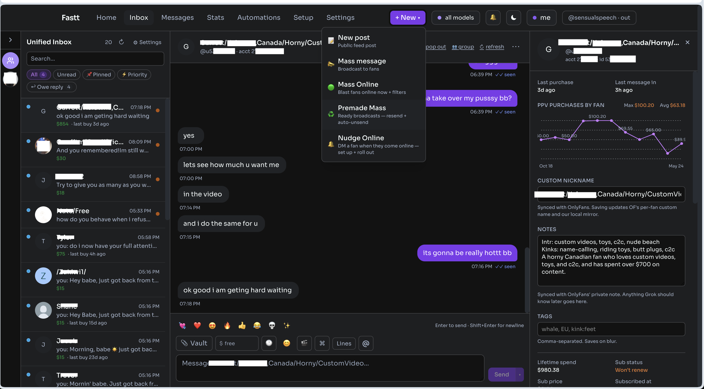

# Fastt



Self-hosted creator dashboard for OnlyFans. A FastAPI relay that holds a
captured browser session, replays requests with proper TLS/headers via
`curl_cffi`, signs each call the way the OF web client does, and serves a
Next.js UI for messaging, mass-messaging, vault, queue, posts, stats,
realtime events, group chat, and per-account proxies.

```
   Next.js UI (app/)
        |  fetch /api/relay/...
        v
   FastAPI relay (service/server.py)
        |  OFClient — adds Sign + Time + X-Hash + ...
        v
   curl_cffi(impersonate=chrome)  ->  https://onlyfans.com/api2/v2/*
                  |
                  +-- (optional) per-session ISP / residential proxy
```

> **Disclaimer.** This project is an independent reverse-engineering of
> OnlyFans' public web API for personal / educational use. Running it
> against a live account may violate OnlyFans' Terms of Service. Use at
> your own risk. The project is not affiliated with or endorsed by
> OnlyFans.

---

## What's in the repo

| path | what it is |
| --- | --- |
| `service/` | FastAPI relay: signing, session bootstrap, OF client, WebSocket pump, SQLite store (`chatterly.db`) |
| `app/` | Next.js dashboard UI (chat, inbox, vault, group chat, setup, etc.) |
| `loginExtension/` | Chrome extension — one-click session capture (no proxy) |
| `noTeleportLoginExtension/` | Chrome extension — login routed through the relay's proxy so cookies mint on the same egress IP |
| `web/` | Legacy single-page UI (kept for parity; the Next.js app is the primary surface) |
| `Dockerfile`, `docker-compose.yml` | Container build + tunnel sidecar |

The SQLite database (`service/chatterly.db`), session blobs
(`service/sessions/`), proxy registry (`service/proxies.json`) and any
captured-cURL examples are **gitignored**. None of them are part of the
repo; they are created locally the first time you boot.

---

## Deploy to your own VPS — one command

Put Fastt on a VPS (Hostinger, Hetzner, DigitalOcean…) behind a public URL.
**No GitHub fork needed** — the script clones this public repo onto your server,
installs Docker, writes your secrets, builds, and prints a `trycloudflare.com`
URL. You change **one line** (your VPS IP) and fill in your secrets.

```bash
git clone https://github.com/BlackPhoenixSlo/inflowwkiller.git
cd inflowwkiller

# Edit the EDIT-BEFORE-RUNNING block in scripts/deploy-vps.sh:
#   • SSH_TARGET   → root@<your-vps-ip>      (the only required change)
#   • DEEPSEEK_API_KEY                       (the AI that writes messages)
#   • SESSION_SECRET / CHATTER_SESSION_SECRET → each `openssl rand -hex 32`
# Everything else (repo URL, branch main) is pre-filled.

./scripts/deploy-vps.sh
# …or skip even editing the file and pass the host inline:
./scripts/deploy-vps.sh root@<your-vps-ip>
```

Prereq: `ssh root@<your-vps-ip>` works with your key (no password). The server
boots with no OnlyFans login — connect one after deploy with the bundled Chrome
extension (Step 4 in the walkthrough).

- **[DEPLOY.md](DEPLOY.md)** — illustrated, click-by-click walkthrough. You can
  paste it straight into [Claude Code](https://claude.com/claude-code) and have
  the deploy done with you.
- **[DEPLOY_HOWTO.md](DEPLOY_HOWTO.md)** — the dense reference (secrets, migrations,
  running alongside another stack, rollback).
- **[CLAUDE.md](CLAUDE.md)** — orientation for an AI agent working in this repo.

---

## Quick start (Docker)

Requires Docker 20+ with the `compose` plugin.

```bash
git clone https://github.com/BlackPhoenixSlo/inflowwkiller.git
cd inflowwkiller

# First boot needs an empty proxy registry so the bind-mount has something
# to attach to. (You will fill it from the UI.)
echo '{"proxies": []}' > service/proxies.json

docker compose up -d --build
open http://127.0.0.1:8787/ui/
```

The UI loads but `/health` will be red — that is expected. There is no
captured session yet.

### Step 1 — capture a session

The easiest path is the Chrome extension shipped in this repo.

1. Load `loginExtension/` as an unpacked extension at `chrome://extensions`
   (toggle Developer mode, "Load unpacked").
2. Log into onlyfans.com in that browser.
3. Click the Fastt extension icon → **Capture**. The extension reads
   the live cookies + signing headers and posts them to the relay's
   bootstrap endpoint.
4. The relay parses the payload, downloads OF's signing chunk through
   your session, derives the signing rules, and writes a session file to
   `service/sessions/`. `/health` turns green.

If you need to bind the OF login session to a specific egress IP (i.e.
the same proxy the relay will use), use `noTeleportLoginExtension/`
instead. It routes the login itself through the configured proxy so the
session cookies mint on the IP that will later replay them.

### Step 2 — add proxies (optional but strongly recommended)

If you plan to host more than one account from this relay, each account
needs its own egress IP. Same WAN IP + multiple OF accounts ⇒
linked-account ban.

In **Setup → Proxies**:

- **+ add new proxy** — paste `host`, `port`, optional `user`/`pass`, and
  notes (city / ASN). Stored in `service/proxies.json`.
- **Test** — probes egress IP + geo through the proxy.
- **Assign** — binds the proxy to one captured session file. One session
  per proxy (1:1).

Datacenter proxies work for the initial wiring test but get soft-locked
by OF quickly. For production use ISP or static-residential proxies, one
per account's home city.

After assignment, reload `/health` — the JSON now includes
`proxy.label` and the live `egress_ip`. That is what OF sees.

### Step 3 — share the UI (optional)

`docker compose up -d` only listens on `127.0.0.1`. To hand out a public
URL without touching your router, set a share token and start the
Cloudflare quick-tunnel profile:

```bash
export SHARE_TOKEN=$(openssl rand -hex 24)
docker compose --profile tunnel up -d
docker compose logs -f tunnel        # wait for the trycloudflare.com line
```

Share the URL as:

```
https://<random>.trycloudflare.com/ui/?t=$SHARE_TOKEN
```

The token middleware accepts the `?t=` once and drops a 7-day cookie.
Without it every request returns 401.

> Anyone with the link is acting as your captured OF account. Treat the
> URL and the `SHARE_TOKEN` like a password.

The trycloudflare subdomain changes every restart because quick tunnels
are stateless. For a permanently-stable URL set up a named Cloudflare
tunnel (requires a Cloudflare account + a domain).

---

## Running without Docker (development)

```bash
# Relay
python3 -m venv venv
./venv/bin/pip install -r requirements.txt
./venv/bin/uvicorn service.server:app --reload --port 8787

# Next.js UI (separate terminal)
cd app
pnpm install
pnpm dev          # http://localhost:3001
```

The UI talks to the relay through the rewrites declared in
`app/next.config.ts`. If you add a new relay route, add a matching
rewrite there — otherwise Next will 404 before the request ever reaches
the relay.

---

## On-disk layout

```
service/
  server.py              FastAPI app (relay + admin + WS fan-out)
  of_client.py           signed HTTP client (curl_cffi + proxy routing)
  of_signer.py           the OF signing algorithm, in Python
  of_ws.py               OF WebSocket pump (wss://ws2.onlyfans.com/...)
  session_bootstrap.py   extension + paste-curl bootstrap
  proxies.py             proxy registry (load/save proxies.json + probe)
  live_rev.py            tracks the current OF web revision
  db/                    SQLAlchemy models + migrations
  proxies.json           registry        (gitignored, bind-mounted)
  chatterly.db           local SQLite    (gitignored, bind-mounted)
  sessions/              captured sessions (gitignored, bind-mounted)
app/
  app/, components/,     Next.js 15 dashboard (chat, inbox, vault,
  hooks/, lib/, ...      group chat, setup, etc.)
loginExtension/          MV3 Chrome extension — one-click capture
noTeleportLoginExtension/ MV3 extension — login over the relay's proxy
web/                     legacy single-page UI
Dockerfile, docker-compose.yml, requirements.txt
```

### Backing up state

```bash
tar czf fastt-backup-$(date +%F).tgz \
  service/sessions service/proxies.json service/chatterly.db
```

Drop the tarball back into a fresh clone and you are running again — no
re-bootstrap required (until the OF revision rolls and your stored
`x_of_rev` is stale, at which point one extension capture takes ~30 s).

---

## Day-2 operations

| task | how |
| --- | --- |
| OF rolled a new revision | Extension → Capture again |
| swap proxy on a session | Setup → Proxies → Assign |
| add a new account | Capture in a fresh browser profile for that account |
| revoke the public share link | `unset SHARE_TOKEN; docker compose --profile tunnel down` |
| update | `git pull && docker compose up -d --build` |
| nuke and restart | `docker compose down -v && docker compose up -d --build` |
| view live OF events | UI → Events tab (consumes `/ws/events`) |

---

## Security notes

- The relay is authenticated as your OF account. Anyone with read access
  to the UI or to `service/sessions/` can act as you on OF. Treat the
  sessions volume like a password file.
- `service/proxies.json` stores proxy credentials in plaintext. Both
  that file and `service/sessions/` are in `.gitignore`; keep them out
  of any copy you push to a remote.
- The cloudflared tunnel terminates TLS at Cloudflare's edge, then talks
  to the container over the compose-internal docker network. The
  `SHARE_TOKEN` middleware is the only thing standing between a leaked
  `trycloudflare` URL and full account access.
- The relay never falls back to direct egress if an assigned proxy
  fails. A `502 upstream` with a `proxy: {...}` block in `/health` means
  the proxy itself is down — fix or unassign before continuing.

---

## Contributing

Issues and PRs are welcome. Please do not include real session files,
proxy credentials, account IDs, fan IDs, or screenshots containing
those in bug reports — open a private channel for anything that could
identify a real account.

---

## License

MIT — see [LICENSE](LICENSE).
